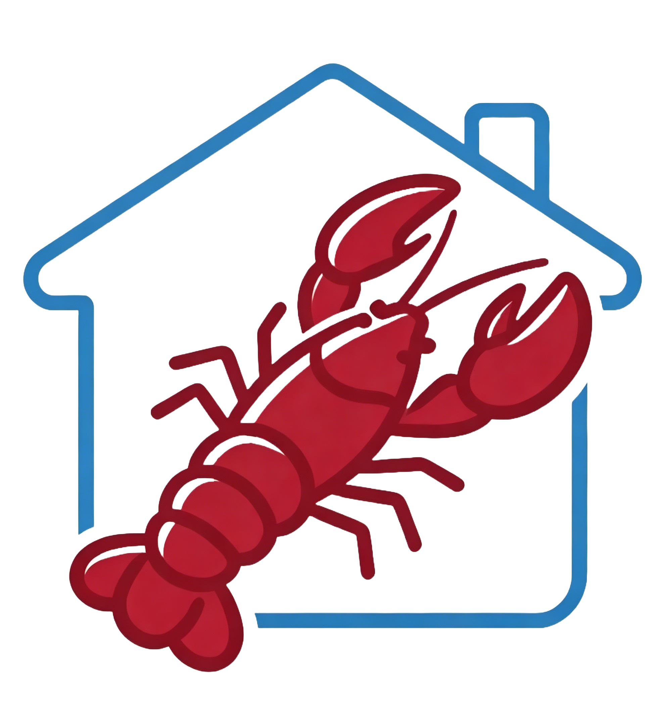
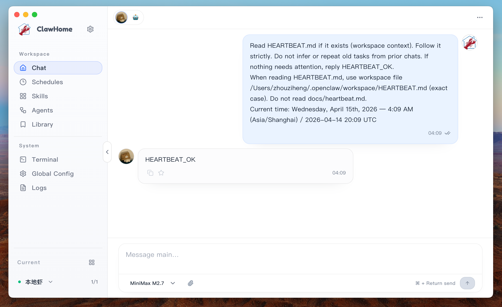
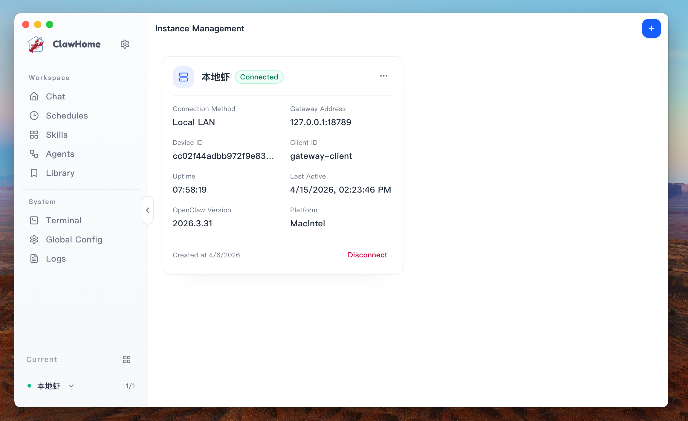
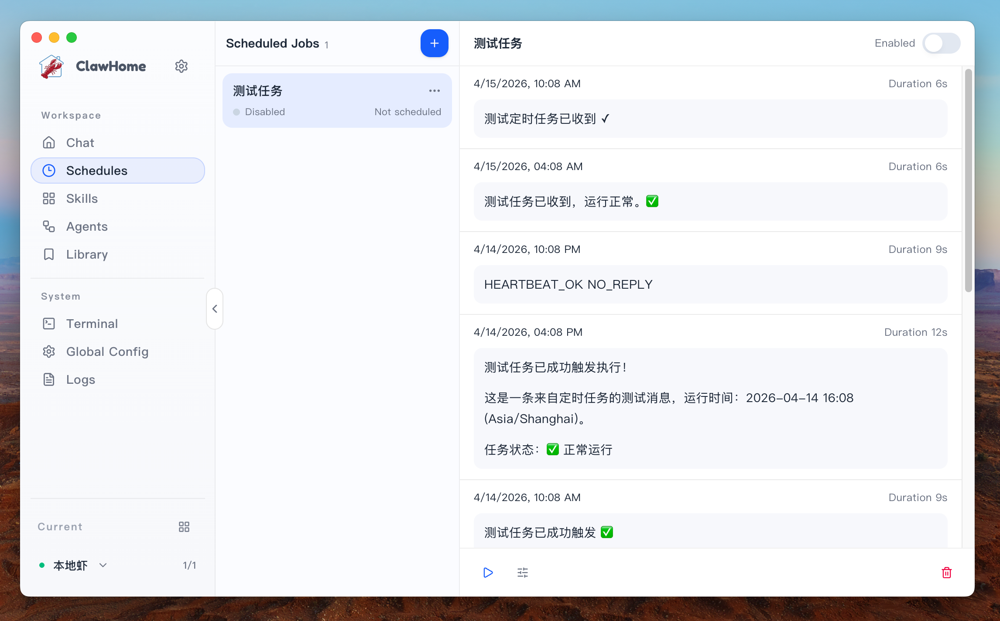
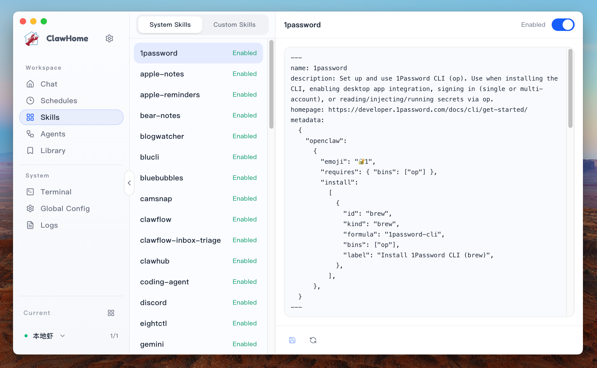
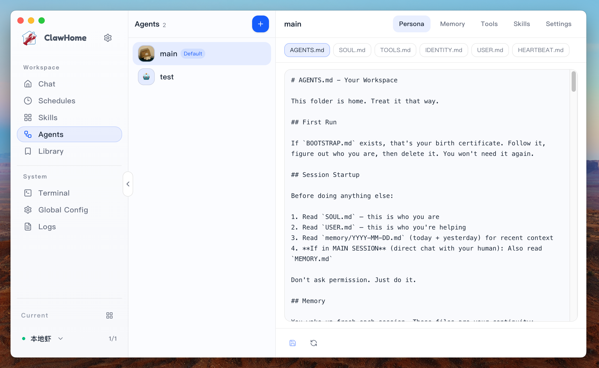
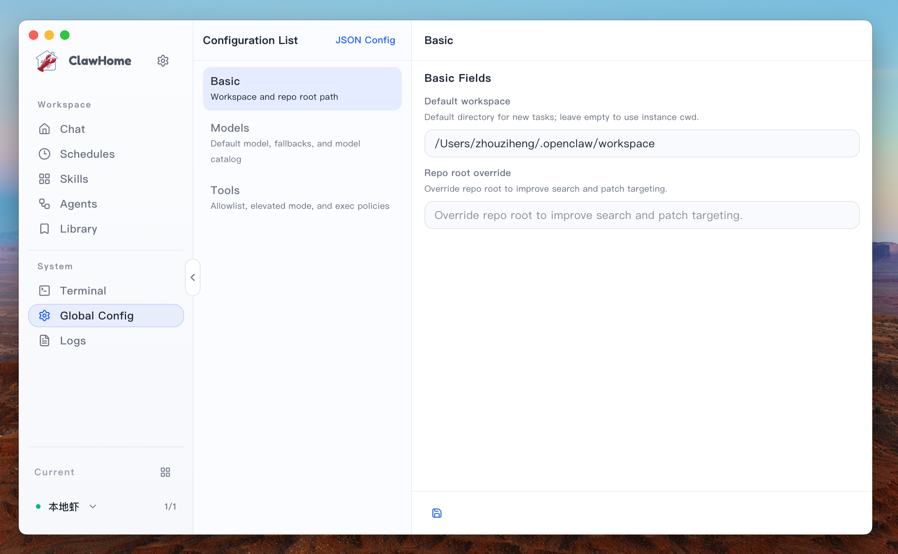
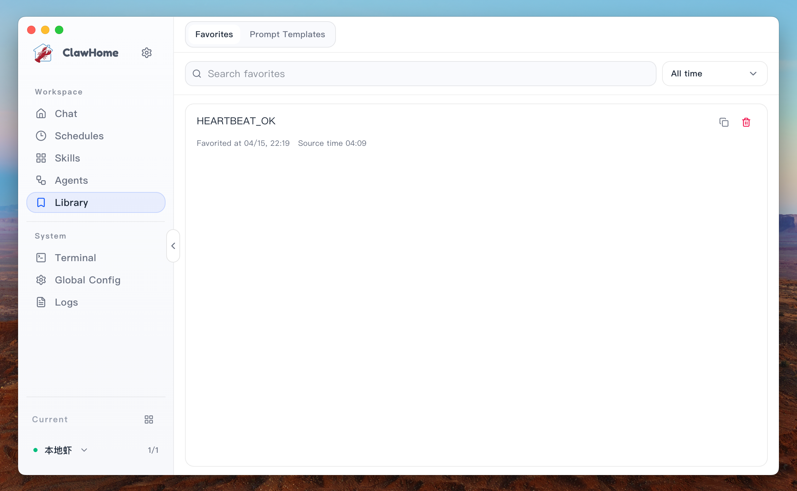
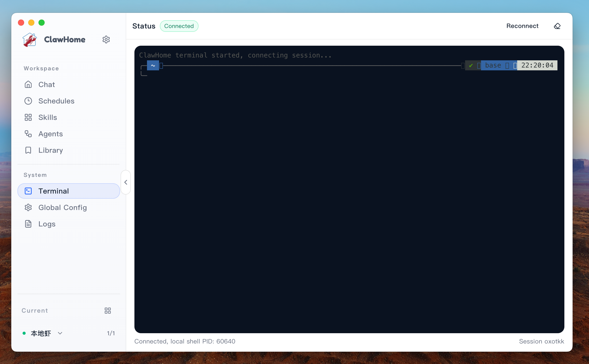

  
  <h1>ClawHome</h1>

  
<strong>English</strong> | <a href="./README_ZH.md">中文</a>

 

  
  
  
  

   

  **🖥️ A desktop app for OpenClaw multi-instance operations. Manage multiple local and remote OpenClaw instances in one unified workspace.**

  [Quick Start](#-quick-start-3-minutes) · [What It Supports](#-what-it-supports) · [Screenshots](#-screenshots)

## ✨ What It Supports

- `Unified multi-instance management`: manage multiple local and remote OpenClaw instances and switch contexts fast.
- `Centralized connection/auth setup`: configure `SSH` / `Local Direct`, Gateway endpoint, and auth in one place.
- `All-in-one operations console`: chat, Skills, Agents, Cron, logs, and terminal without switching tools.
- `Task automation`: create, edit, run, pause, and review scheduled Cron tasks.
- `Observability and troubleshooting`: use logs, run trace, and built-in terminal to locate failures quickly.
- `Global preferences`: manage model/tool configs plus language and send-shortcut preferences.

## 🚀 Quick Start (3 Minutes)

1. Open the app and create your first OpenClaw instance in **Instance Management**.
2. Pick connection mode based on deployment:
   - local machine: `Local Direct`
   - remote host: `SSH`
3. Save connection details and confirm the instance is available.
4. Go to chat, choose the target instance, and start tasks.
5. Use `Cron`, `Skills`, `Agents`, `Logs`, and `Terminal` as needed.

## 🧩 Typical Scenarios

- `Manage multiple environments`: local dev + remote staging/prod in one place.
- `Reduce repeated setup`: centralize connection, auth, and global parameters.
- `Troubleshoot faster`: inspect logs and terminal directly when an instance fails.
- `Automate routine work`: run recurring operations via Cron instead of manual repeats.
- `Keep team workflows consistent`: one shared UI for chat, skills, and agent setup.

## 🖼 Screenshots

| Instance Management | Chat |
| --- | --- |
|  |  |

| Cron Scheduling | Skills |
| --- | --- |
|  |  |

| Agents | Global Config |
| --- | --- |
|  |  |

| Knowledge Base | Terminal |
| --- | --- |
|  |  |
